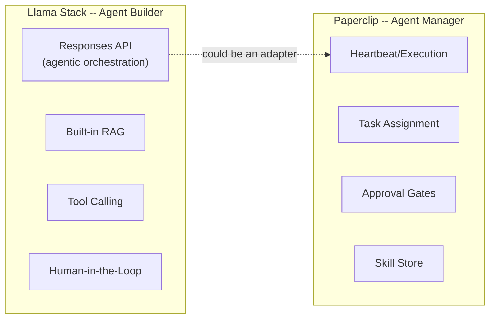
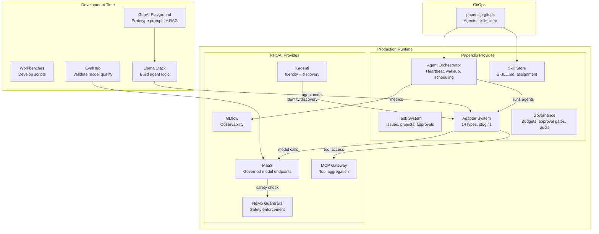

# RHOAI 3.4 Agentic Capabilities vs Paperclip

## RHOAI 3.4 Agentic Features (From Official Docs)

### Tier 1: Llama Stack (Agent Runtime -- Technology Preview)

**What it is:** A unified AI runtime for building agentic applications. Managed by the Llama Stack Operator via `LlamaStackDistribution` custom resource.

**What it does (per docs):**
- Exposes **OpenAI-compatible APIs** (Responses API, Chat Completions)
- **Responses API** -- high-level orchestration layer for agentic apps (OpenAI parity in 3.4)
- **RAG built-in** -- file upload, vector stores, retrieval, all through API
- **Tool calling** -- models call external tools via function-calling APIs
- **Human-in-the-Loop (HIL)** -- users approve/reject tool calls before execution (Developer Preview)
- **MCP HTTP streaming** -- Llama Stack providers compatible with MCP protocol (Developer Preview)
- Connects to vLLM inference, PostgreSQL metadata store, vector DBs

**Support level:** Technology Preview (Llama Stack itself); Responses API is Tech Preview; HIL is Developer Preview

**Paperclip overlap?** Partial. Llama Stack is an **agent builder framework** -- it helps you BUILD agents. Paperclip is an **agent control plane** -- it MANAGES agents. They operate at different layers.



---

### Tier 2: Kagenti (AgentOps -- Developer Preview)

**What it is:** Framework-agnostic agent lifecycle management for Kubernetes. Two custom resources.

**AgentCard CR:**
- Deploy any agent as a K8s Deployment/StatefulSet with label `kagenti.io/type: agent`
- Add protocol label like `protocol.kagenti.io/a2a`
- Platform auto-creates an `AgentCard` advertising: capabilities, endpoints, supported protocols
- Enables **machine-readable agent-to-agent (A2A) discovery**

**AgentRuntime CR:**
- Reference your agent's Deployment via `spec.targetRef`
- Operator auto-injects sidecars:
  - **Envoy AuthBridge** -- inbound JWT validation, outbound token exchange
  - **SPIFFE identity** -- workload identity via spiffe-helper
  - **OpenTelemetry traces** -- per-agent trace config
- Per-workload overrides for trust domains, OTEL endpoints, sampling rates
- Opt-out with `kagenti.io/inject: disabled`

**Support level:** Developer Preview (not even Tech Preview -- no SLA, not production-ready)

**Paperclip overlap?** This is the most interesting area:

| Capability | Kagenti | Paperclip | Overlap? |
|---|---|---|---|
| Agent discovery | AgentCard (A2A protocol) | Agent REST API + MCP server | **Different protocols, same goal** |
| Agent identity | SPIFFE workload identity | Agent API keys (Bearer) | **Different mechanisms** |
| Agent auth | Envoy JWT proxy | better-auth + agent key hashing | **Different layers** |
| Agent observability | OpenTelemetry injection | Activity log + run log store | **Complement** |
| Agent lifecycle | Deploy/scale K8s resources | Heartbeat scheduler, pause/resume | **Different levels** |
| Agent-to-agent comms | A2A protocol | Task delegation (parentId, blockedBy) | **Different paradigms** |

---

### Tier 3: MCP Ecosystem (Mixed Maturity)

**MCP Catalog + Gateway (Developer Preview):**
- Browse and deploy MCP servers from catalog UI
- `mcp-lifecycle-operator` manages `MCPServer` CRs -> Deployments/Services
- `mcp-gateway` aggregates multiple MCP servers behind single endpoint
- Pre-loaded servers: Red Hat OpenShift, Ansible, Insights, Confluent, EDB, HashiCorp, Microsoft Azure, Dynatrace

**RHOAI MCP Server (Developer Preview):**
- RHOAI itself acts as an MCP server for external clients (Claude Code, OpenCode, Gemini CLI)
- Recommends models from registry, manages projects/workbenches, monitors pipelines
- Generates K8s manifests for deployment

**Playground MCP Integration (Technology Preview):**
- Playground UI connects to registered MCP servers
- Users authorize tool access per session
- Models use tools via function calling

**Paperclip overlap?**
- Paperclip ALSO has an MCP server (40 tools wrapping the REST API)
- Paperclip agents could consume MCP tools from the RHOAI MCP Gateway
- RHOAI MCP Catalog could deploy Paperclip's MCP server as a managed service

---

### Tier 4: Model Serving for Agents (GA)

**MaaS (GA):**
- Governed model endpoints for agents to call
- Subscription-based token quotas per team
- Self-service API key management
- OpenAI-compatible

**NeMo Guardrails (GA):**
- Safety proxy/checks for agent model calls
- PII detection, content filtering, custom rails
- `/v1/guardrails/checks` standalone endpoint

**Tool Calling Model Catalog (Developer Preview):**
- Model cards now show tool-calling metadata
- Filter catalog for models validated for function calling
- Validated parameters: `--enable-auto-tool-choice`, `--tool-call-parser`, chat templates

---

### Tier 5: Agent Evaluation (Mixed)

**EvalHub (Tech Preview):**
- Evaluate LLMs against benchmarks
- Custom adapters possible
- Does NOT evaluate agent behavior directly (evaluates model endpoints)

**LM-Eval on Llama Stack + TrustyAI (Developer Preview):**
- Run LM-Eval within Llama Stack with content moderation
- Integrated with TrustyAI detectors

**GenAI Playground (Tech Preview):**
- Interactive prompt testing with RAG and MCP
- Export as Python template

---

## How Paperclip and RHOAI Agentic Parts Fit Together



---

## The Key Insight: Two Different Agent Paradigms

| | RHOAI Agentic | Paperclip |
|---|---|---|
| **Paradigm** | Agent-as-a-Service (deploy, scale, discover) | Agent-as-a-Worker (assign, execute, report) |
| **Agent lifecycle** | K8s Deployment -> AgentCard -> A2A discovery | DB record -> heartbeat schedule -> task assignment |
| **Communication** | A2A protocol, MCP, direct API calls | Task delegation (parent/child issues, blockedBy) |
| **Identity** | SPIFFE, JWT (cryptographic) | API keys, hashed at rest |
| **Governance** | Token quotas (MaaS), guardrails | Budget enforcement, approval gates, activity audit |
| **Skills/Tools** | MCP servers, tool calling | Skill store (SKILL.md), adapter-native tools |
| **Maturity** | Developer Preview (Kagenti), Tech Preview (Llama Stack) | GA (shipping product) |

**They solve different problems:**
- RHOAI answers: "How do I **build, serve, and discover** AI agents on Kubernetes?"
- Paperclip answers: "How do I **organize, assign work to, and govern** a team of AI agents?"

---

## Concrete Integration Opportunities (Agentic-Specific)

### Opportunity A: Paperclip agents served as Kagenti AgentCards

Paperclip deploys agents as processes (CLI) or HTTP calls. With Kagenti, each Paperclip agent could ALSO be discoverable via A2A:

```yaml
# Label the Paperclip deployment
metadata:
  labels:
    kagenti.io/type: agent
    protocol.kagenti.io/a2a: ""
```

This would make Paperclip agents visible to any A2A-compatible system on the cluster. The `AgentCard` would advertise capabilities like "pitch-builder" or "rfq-response".

**Value:** Cross-platform agent discovery. Other teams' agents (not managed by Paperclip) could find and interact with Paperclip-managed agents.

**Blocker:** Developer Preview. Not production-ready.

---

### Opportunity B: Llama Stack as a Paperclip adapter

Llama Stack's Responses API could be a new Paperclip adapter type (like `llamastack_local`). This would let Paperclip orchestrate agents built on Llama Stack instead of just CLI tools.

**Value:** Agents built with Llama Stack's RAG + tool calling could be managed by Paperclip's task system.

**Blocker:** Technology Preview. Would need a new adapter in Paperclip.

---

### Opportunity C: RHOAI MCP Gateway as Paperclip tool provider

The MCP Gateway aggregates tools from Red Hat OpenShift, Ansible, Insights, Confluent, etc. Paperclip agents (via Hermes adapter or MCP-capable CLIs) could call the gateway for tools.

**Value:** Agents get access to enterprise tools (Ansible playbooks, OpenShift management, DB queries) without per-agent configuration.

**Blocker:** Developer Preview. MCP client support varies by adapter.

---

### Opportunity D: Kagenti AgentRuntime for Paperclip pod security

Apply `AgentRuntime` CR to the Paperclip deployment for automatic injection of:
- SPIFFE identity (cryptographic workload identity)
- OpenTelemetry traces (agent execution visibility)
- AuthBridge (JWT validation on inbound API calls)

**Value:** Enterprise-grade identity and observability without modifying Paperclip code.

**Blocker:** Developer Preview. May conflict with Paperclip's own auth system.

---

## Maturity Reality Check

| Feature | Status | Recommendation |
|---|---|---|
| MaaS | **GA** | Use now for model governance |
| NeMo Guardrails | **GA** | Use now for safety |
| MLflow | **GA** | Use now for tracking |
| AI Pipelines | **GA** | Use now for harness |
| Llama Stack | **Tech Preview** | Evaluate, don't depend on |
| EvalHub | **Tech Preview** | Use for dev, not production gates |
| GenAI Playground | **Tech Preview** | Use for exploration |
| Kagenti (AgentCard, AgentRuntime) | **Developer Preview** | Watch, don't use in production |
| MCP Catalog/Gateway | **Developer Preview** | Watch, prototype only |
| HIL in Llama Stack | **Developer Preview** | Watch |
| RHOAI MCP Server | **Developer Preview** | Watch |

**Bottom line:** The GA services (MaaS, Guardrails, MLflow, Pipelines) are ready for integration today. The agentic-specific features (Kagenti, Llama Stack, MCP Gateway) are too early for production use but are the right direction for future architecture.
