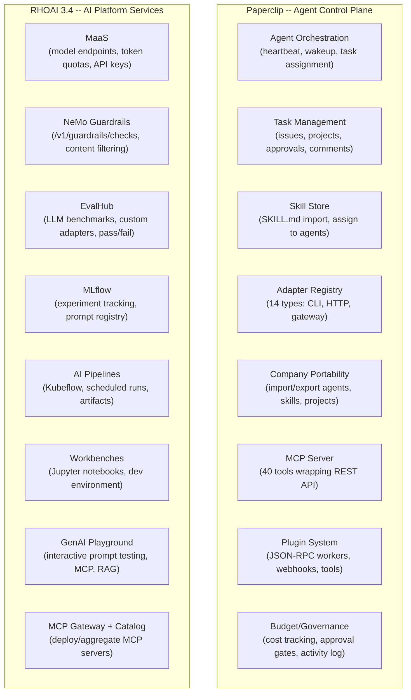
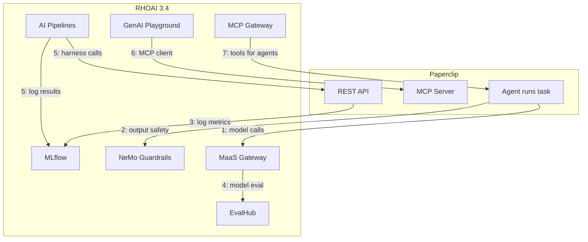

# Paperclip + RHOAI 3.4 Integration Analysis

## What Each System Owns (No Overlap)



---

## Integration Points (Where They Actually Connect)

### Integration 1: Paperclip agents consume RHOAI-served models via MaaS

**How it connects:**
- Paperclip agents use CLI adapters (gemini, claude, codex) that call LLM APIs
- RHOAI MaaS exposes models as OpenAI-compatible endpoints with subscription-based governance
- Agent `adapterConfig.model` or environment variables point to MaaS gateway URL instead of direct provider APIs

**Protocol:** OpenAI-compatible HTTPS REST (MaaS gateway endpoint)

**What Paperclip provides:** Agent identity, task context, execution orchestration
**What RHOAI provides:** Model endpoint, token quota enforcement, usage tracking, API key management

**Concrete wiring:**
```
Agent adapterConfig:
  model: "granite-3.3-8b-instruct"
  env:
    OPENAI_API_BASE: "https://maas-gateway.rhoai.svc/v1"
    OPENAI_API_KEY: "<from MaaS subscription>"
```

**Value:** Centralized model governance. Instead of each agent bringing its own API key to Anthropic/Google/OpenAI, all model access flows through MaaS with quotas per team.

---

### Integration 2: NeMo Guardrails as a safety proxy for agent model calls

**How it connects:**
- NeMo Guardrails sits between agent adapter and model endpoint
- Agent calls go through guardrails `/v1/chat/completions` (OpenAI-compatible) instead of directly to model
- Guardrails applies: sensitive data detection, content filtering, custom validation rails
- OR: use standalone `/v1/guardrails/checks` endpoint as a post-processing validation

**Protocol:** OpenAI-compatible HTTPS REST (guardrails proxy) or standalone REST check

**What Paperclip provides:** Agent output text (from task completion)
**What RHOAI provides:** Policy enforcement, PII detection, content safety scoring

**Two wiring options:**

Option A -- Inline proxy (agent calls go through guardrails):
```
Agent adapterConfig:
  env:
    OPENAI_API_BASE: "https://nemo-guardrails.rhoai.svc/v1"  # guardrails proxy
```

Option B -- Post-hoc check (Paperclip plugin calls guardrails after agent run):
```
Plugin webhook on task completion:
  POST https://nemo-guardrails.rhoai.svc/v1/guardrails/checks
  Body: { agent output text }
  Response: pass/fail + flagged content
```

---

### Integration 3: MLflow tracks agent/skill performance over time

**How it connects:**
- Paperclip plugin or PostSync Job logs metrics to MLflow after agent task completion
- Metrics: task completion time, output length, user satisfaction (if rated), error rate
- MLflow experiments track these across agent versions (git commits to AGENTS.md)

**Protocol:** MLflow Tracking API (HTTPS)

**What Paperclip provides:** Task completion data (via REST API: issue status, run duration, run result)
**What RHOAI provides:** Experiment storage, versioned tracking, comparison UI

**Concrete wiring:**
```python
import mlflow
mlflow.set_tracking_uri("http://mlflow.mlflow.svc:5000")
mlflow.set_experiment("agent-pitch-builder")
with mlflow.start_run(run_name="v2.3-prompt-update"):
    mlflow.log_metric("task_completion_time_sec", 45)
    mlflow.log_metric("output_quality_score", 0.87)
    mlflow.log_param("agent_version", "git-sha-abc123")
```

---

### Integration 4: EvalHub validates model quality before agent model changes

**How it connects:**
- When someone changes an agent's model (e.g., Granite 3.3 -> Granite 4.0), EvalHub runs benchmarks against both
- EvalHub needs an OpenAI-compatible model endpoint URL -- MaaS provides this
- Results (MMLU score, safety benchmarks) feed into the PR review decision

**Protocol:** EvalHub REST API (`/api/v1/evaluations/jobs`)

**What Paperclip provides:** Nothing directly (this is pre-deployment validation)
**What RHOAI provides:** Benchmark orchestration, pass/fail scoring, MLflow result logging

**Note:** EvalHub evaluates **models**, not agent behavior. It answers "is Granite 4.0 good enough?" not "does the Pitch Builder agent produce good pitches?" For agent behavior testing, use Integration 5.

---

### Integration 5: AI Pipelines as the agent/skill harness

**How it connects:**
- A Kubeflow Pipeline runs as the "harness" -- a multi-step validation workflow
- Steps: deploy agent to sandbox namespace -> create test task via Paperclip REST API -> wait for completion -> pull result -> score -> log to MLflow
- Pipeline triggered by GitHub Action on PR (via KFP SDK or pipeline server REST API)

**Protocol:** Kubeflow Pipelines REST API + Paperclip REST API

**What Paperclip provides:** REST API for task creation, agent execution, result retrieval
**What RHOAI provides:** Pipeline orchestration, isolated job execution, artifact tracking

**Concrete pipeline steps:**
```
Step 1: paperclipai skills import (validate + import skill to sandbox)
Step 2: POST /api/agents/{id}/wakeup (trigger agent in sandbox)
Step 3: Poll GET /api/issues/{id} until status=done or timeout
Step 4: GET /api/issues/{id}/activity (retrieve agent output)
Step 5: POST nemo-guardrails/v1/guardrails/checks (safety check)
Step 6: mlflow.log_metrics(scores)
Step 7: Report pass/fail back to GitHub PR
```

---

### Integration 6: Paperclip MCP Server accessible from GenAI Playground

**How it connects:**
- RHOAI Playground supports connecting to external MCP servers
- Paperclip exposes an MCP server with 40 tools (list issues, create tasks, check agent status)
- Cluster admin registers Paperclip MCP server in the Playground ConfigMap
- Users can interact with Paperclip data from within Playground

**Protocol:** MCP over HTTPS (Paperclip MCP server exposed via Route)

**What Paperclip provides:** MCP server with Paperclip operational tools
**What RHOAI provides:** Playground UI as the MCP client

**Wiring:**
```yaml
# ConfigMap: gen-ai-aa-mcp-servers (redhat-ods-applications)
data:
  Paperclip-MCP: |
    {
      "url": "https://paperclip-mcp.paperclip.svc:3100/mcp",
      "description": "Paperclip agent control plane - list agents, create tasks, check status"
    }
```

**Note:** Playground is Tech Preview. This integration is experimental.

---

### Integration 7: RHOAI MCP Gateway aggregates MCP servers for Paperclip agents

**How it connects:**
- RHOAI MCP Catalog + Gateway can deploy and aggregate multiple MCP servers
- Paperclip agents (via adapters that support MCP, like Hermes) can connect to the RHOAI MCP Gateway as a unified tool endpoint
- Agents get access to tools from multiple MCP servers without individual configuration

**Protocol:** MCP over HTTPS (RHOAI MCP Gateway)

**What Paperclip provides:** Agent execution context, task assignment
**What RHOAI provides:** MCP server lifecycle management, aggregation, unified endpoint

**Note:** Requires adapters that support MCP client (Hermes does; generic CLI adapters inherit MCP from the underlying tool). MCP Catalog is Tech Preview.

---

## Integration Map Summary



---

## What RHOAI Does NOT Replace in Paperclip

| Paperclip Capability | Could RHOAI replace it? | Verdict |
|---|---|---|
| Agent heartbeat/execution | No (RHOAI has no agent orchestrator) | Paperclip only |
| Task assignment/tracking | No (RHOAI has no task system) | Paperclip only |
| Skill store management | No (RHOAI has no skill concept) | Paperclip only |
| Adapter system (14 types) | No (RHOAI serves models, doesn't run agents) | Paperclip only |
| Company portability/GitOps | No (RHOAI has no company config) | Paperclip only |
| Approval gates/governance | No (RHOAI has model governance, not task governance) | Paperclip only |
| Budget tracking | Partial overlap with MaaS token quotas | **Complement**: MaaS handles model-level quotas, Paperclip handles task-level budgets |

---

## Not Worth Integrating (Low Value or Wrong Fit)

| RHOAI Service | Why NOT to integrate with Paperclip |
|---|---|
| **Workbenches** | Useful for SSA development, but no Paperclip integration needed -- they just use git |
| **Model Registry** | Paperclip agents don't deploy models -- they call them. MaaS handles the endpoint |
| **Feature Store** | ML feature engineering -- irrelevant to agent orchestration |
| **Model Catalog** | Useful for choosing models, but agents consume via MaaS, not directly from catalog |
| **Distributed Inference (llm-d)** | Infrastructure-level model serving -- transparent to Paperclip |

---

## Recommended Integration Priority

| Priority | Integration | Effort | Value |
|---|---|---|---|
| **P1** | MaaS model governance for agents | Low (env var config) | High (centralized cost control) |
| **P2** | NeMo Guardrails safety checks | Medium (proxy or plugin) | High (prevent unsafe outputs) |
| **P3** | MLflow experiment tracking | Medium (logging script) | Medium (regression detection) |
| **P4** | AI Pipelines harness | High (full pipeline build) | High (automated testing) |
| **P5** | EvalHub model validation | Medium (API calls) | Medium (model change confidence) |
| **P6** | Playground MCP connection | Low (ConfigMap only) | Low (experimental, nice demo) |
| **P7** | MCP Gateway for agents | Medium (adapter config) | Low (few agents use MCP) |
